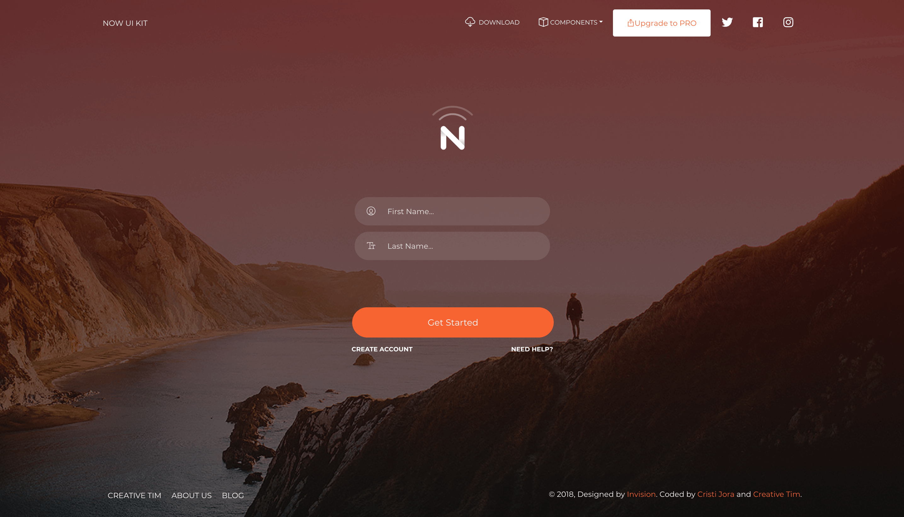

# [Vue Now UI Kit]()

**[Vue Now UI Kit](http://demos.creative-tim.com/vue-now-ui-kit)** is a responsive Bootstrap 4 kit provided for free by Invision and Creative Tim. It is a beautiful cross-platform UI kit featuring over 50 elements and 3 templates.

Vue Now UI Kit is one of the most popular UI Kits online, provided in PSD and Sketch formats by Invision. We wanted to find a way for developers worldwide to benefit from using it. So, in collaboration with Invision, we are launching the HTML version for it!

Now will help you create a clean and simple website that is a perfect fit for today's flat design. It is built using the 12 column grid system, with components designed to fit together perfectly. It makes use of bold colours, beautiful typography, clear photography and spacious arrangements.

Create awesome, lifelike prototypes with InVision and Now so your users can experience and give feedback on your vision!

To get the PSD and Sketch files, please visit Invision (https://www.invisionapp.com/now).

## Versions

| HTML | Vue | Angular |
| --- | --- | --- |
|  |  | 

## Demo

| Components | Landing | Profile | Login |
| --- | --- | --- | --- |
|  |  |  | 

[View More](https://demos.creative-tim.com/vue-now-ui-kit).

## Quick start

Quick start options:

- Clone the repo: `git clone https://gitlab.com/pradanadike5/tes-repo-terbaru.git`.
- Run `npm install` or `yarn install`
- Run `npm run serve` to start a local development server

## Browser Support

At present, we officially aim to support the last two versions of the following browsers:

    

